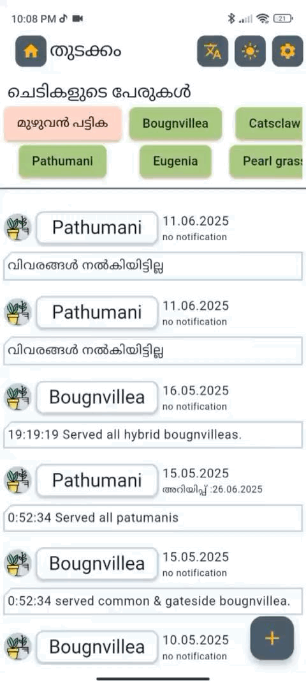
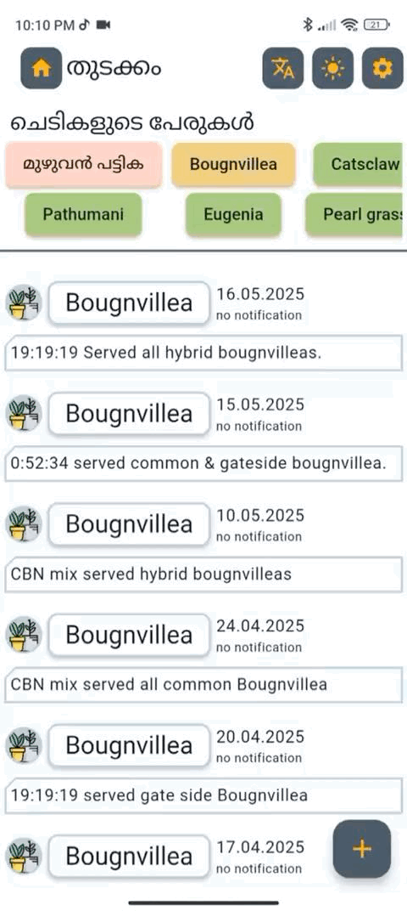

# Plant-App

Indoor plants🪴 are considered as the best hobby😊 nowadays due to the relaxation and peacefullness that the hobby offers. However since these plants are grown indoors, the poor little plants could not gain maximum sunlight☀️ and soil nutrients as compared to the outdoor ones. So it would be an integral part in providing these plants with regular and timed supply of food(soil nutrients) so as to ensure they grow healthy😁.

## Getting Started: How to feed the plants in a regular time interval?

Conventionally it would be better to Note down the dates in a calendar or something. However, there is no challenge and thigs might be cluttered there. On the other hand having an application which only deals with dedicated issues of feeding the plant is much better and efficient. The application not only arranges the data in a beautiful UI but also sorts📃 the plant which require food immediately on the top of the list and so on...

# How to use?
Download or clone this repo using the following link:
```
https://github.com/ryanromeodev/Plant-App.git
```
Go to project root and execute the following command in console to get the required dependencies:
```
flutter pub get 
```

Run the project from IDE
-This program requires file Read and Write permission.

# Features

## Sort the list according to the date :: `Basic functionality`

Each new and updated entry into the app is sorted as per date in ascending order. so as to have a clear **history track** of what was done previously to the plant.

## Read and write a files 

Files like *active plant* list and deleted or *renamed plant* list is kept on track just in case for an accidential recovery. A **Download**⬇️ button is also available on the *settings*⚙️ action button on the top so as to transfer the data alone as a json file just in case as a fail-safe button.

## User Notification(Notifies the plant data before 2 days)

Notification is triggered on new plant addition and is notified 2 days before the date at which the plant is to be notified of fertilizer suppliment.

## Adding a new plant data


## Update a plant data


## In മലയാളം(native south-indian) and English



## Theme mode for Light and Dark Theme


## Chip level sorting for better UI



## Animation effects of basic Flutter transitions with date and notification state


# Wiki
Check out more information on [Wiki](https://github.com/ryanromeodev/Plant-App/wiki)

# Remarks
I will be happy to answer any questions that you may have on this approach, and if you want to lend a hand with the `Plant-App` then please feel free to submit an issue and/or pull request 🙂. If you liked my work, don’t forget to ⭐ star the repo to show your support. The image assets used is of online resources. Kindly notify on my account just in case to notify me to change anything of such.


